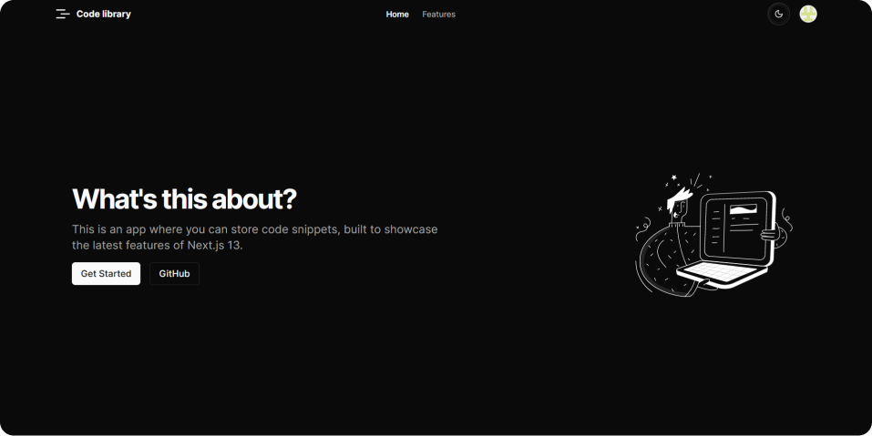
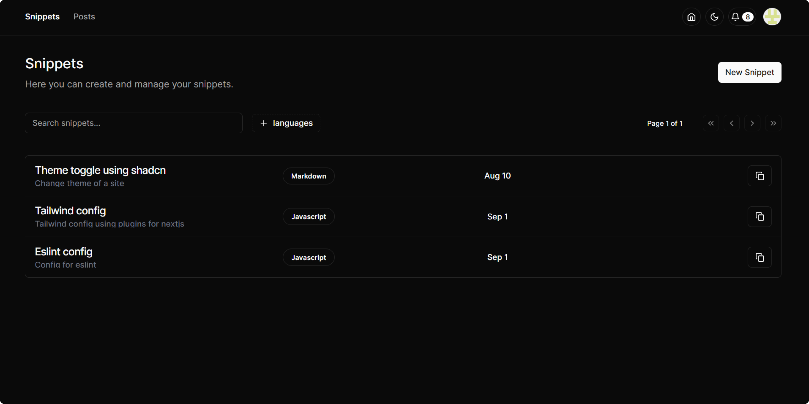
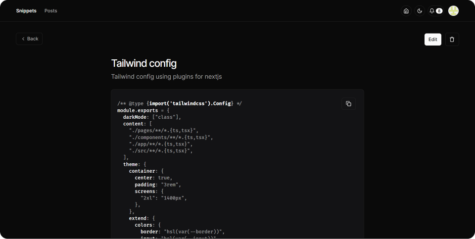

<a href="https://app.code-library.pub">
  
  <h1 align="center">Code library</h1>
</a>

  A dashboard where you can store your code snippets.

## Introduction

This is a personal project built to learn Next.js 13.

### Tech Stack

- **Framework:** [Next.js](https://nextjs.org)
- **Styling:** [Tailwind CSS](https://tailwindcss.com)
- **User Management:** [NextAuth](https://next-auth.js.org/)
- **ORM:** [Prisma](https://prisma.io)
- **UI Components:** [Shadcn/ui](https://ui.shadcn.com)
- **Database:** [Vercel Postgres](https://vercel.com/storage/postgres)
- **Deployment:** [Vercel](https://vercel.com/)

## Features

- New **Nextjs** app dir
- Routing, Layouts, Nested Layouts and Layout Groups
- Server and Client Components
- Data Fetching, Caching and Mutation
- Route handlers
- API Routes and Middlewares
- Validations using **Zod**
- State management using **Zustand**
- Syntax highlighting using **Bright**
- Written in **TypeScript**

## Images

